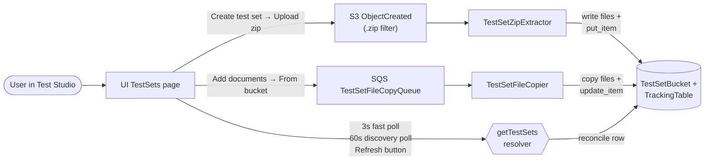
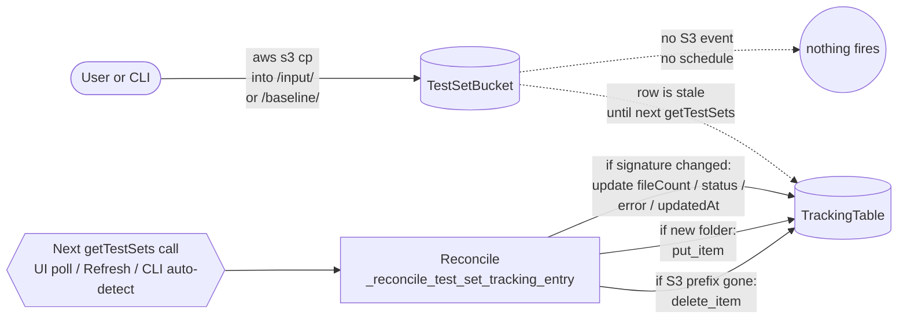
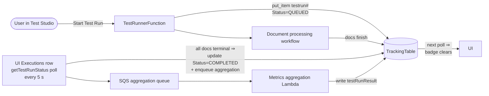
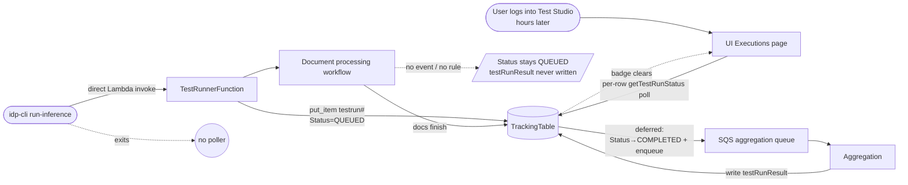

# Test Studio

The Test Studio provides a comprehensive interface for managing test sets, running tests, and analyzing results directly from the web UI.

## Overview

The Test Studio consists of two main tabs:
1. **Test Sets**: Create and manage reusable collections of test documents
2. **Test Executions**: Execute tests, view results, and compare test runs

https://github.com/user-attachments/assets/7c5adf30-8d5c-4292-93b0-0149506322c7


## Generating synthetic test sets

When the [Test Set Generator](extensions/idp-data-generator.md) extension is
installed, the **Test Sets** tab shows a **Generate Test Set** button. It
opens a modal to generate labeled synthetic documents (PDF + ground-truth JSON)
— either from a plain-language description of a document type, or from an
existing configuration version's document class. You can add an optional
**scenario** theme (with an AI **Suggest** helper), choose a **quality** level
(faster vs. higher quality), and see an estimated cost/time band before starting.
Generation runs as a background job; the resulting test set appears in the list
when it completes. Click a test set's name to preview its generated documents
without running a test execution. See the
[Test Set Generator extension](extensions/idp-data-generator.md) for details and
installation.


## Deploying the ConfBench benchmark on demand

The [Test Set - ConfBench](extensions/confbench-testset.md) extension adds the
**amazon/ConfBench** benchmark — the same 75 FCC invoices as
[RealKIE-FCC-Verified](#realkie-fcc-verified) below, each degraded by up to 21
Augraphy noise pipelines (1,346 documents) — for confidence-calibration and OCR
robustness work.

It ships as an optional extension rather than a pre-deployed test set because
the full dataset is **32.71 GB**, roughly 42x the combined size of the four sets
below. After installing it you choose a size tier (from a 0.02 GB clean baseline
up to the full 32.71 GB) or hand-pick individual noise variants, and the ingest
runs as a background job. See the
[Test Set - ConfBench extension](extensions/confbench-testset.md).


## Pre-Deployed Test Sets

The accelerator automatically deploys **four benchmark datasets** from HuggingFace as ready-to-use test sets during stack deployment:

1. **RealKIE-FCC-Verified**: 75 FCC invoice documents
2. **OmniAI-OCR-Benchmark**: 293 diverse document images across 9 formats
3. **DocSplit-Poly-Seq**: 500 multi-page packets with 13 document types
4. **Fake-W2-Tax-Forms**: 2,000 synthetic US W-2 tax form images with 45-field ground truth

All datasets are deployed automatically with zero manual steps required. Each test set has a corresponding **managed configuration version** (e.g., `fake-w2`, `docsplit`) that is auto-selected in Test Studio when the test set is chosen. See [Configuration — Managed Configuration Versions](configuration.md#managed-configuration-versions) for details.

---

### RealKIE-FCC-Verified

**Source**: https://huggingface.co/datasets/amazon-agi/RealKIE-FCC-Verified

This dataset contains 75 invoice documents sourced from the Federal Communications Commission (FCC).

https://github.com/user-attachments/assets/d952fd37-1bd0-437f-8f67-5a634e9422e0

#### Deployment Details

During stack deployment, the system automatically:

1. **Downloads Dataset Metadata** from HuggingFace parquet file (75 documents)
2. **Downloads PDFs** directly from HuggingFace's `pdfs/` directory
3. **Uploads PDFs** to `s3://TestSetBucket/realkie-fcc-verified/input/`
4. **Extracts Ground Truth** from `json_response` field (already in accelerator format!)
5. **Uploads Baselines** to `s3://TestSetBucket/realkie-fcc-verified/baseline/`
6. **Registers Test Set** in DynamoDB with metadata

#### Key Features

### Key Features

- **Fully Automatic**: Complete deployment during stack creation with zero user effort
- **Direct PDF Downloads**: PDFs are downloaded directly from HuggingFace's repository (no image conversion needed)
- **Complete Ground Truth**: Structured invoice attributes (Agency, Advertiser, GrossTotal, PaymentTerms, AgencyCommission, NetAmountDue, LineItems)
- **Benchmark Ready**: 75 FCC invoice documents ideal for extraction evaluation

#### Corresponding Config

Use with: `config_library/unified/realkie-fcc-verified/config.yaml`

---

### OmniAI-OCR-Benchmark

**Source**: https://huggingface.co/datasets/getomni-ai/ocr-benchmark

This dataset contains 293 pre-selected document images across 9 diverse document formats, filtered from the OmniAI OCR benchmark dataset.

#### Document Classes

| Class | Count | Description |
|-------|-------|-------------|
| BANK_CHECK | 52 | Bank checks with MICR encoding |
| COMMERCIAL_LEASE_AGREEMENT | 52 | Commercial property leases |
| CREDIT_CARD_STATEMENT | 11 | Account statements with transactions |
| DELIVERY_NOTE | 8 | Shipping/delivery documents |
| EQUIPMENT_INSPECTION | 11 | Inspection reports with checkpoints |
| GLOSSARY | 31 | Alphabetized term lists |
| PETITION_FORM | 51 | Election petition forms |
| REAL_ESTATE | 59 | Real estate transaction data |
| SHIFT_SCHEDULE | 18 | Employee scheduling documents |

#### Deployment Details

During stack deployment, the system automatically:

1. **Downloads Metadata** from HuggingFace (metadata.jsonl)
2. **Downloads Images** for 293 pre-selected image IDs
3. **Converts to PNG** and uploads to `s3://TestSetBucket/ocr-benchmark/input/`
4. **Extracts Ground Truth** from `true_json_output` field
5. **Uploads Baselines** to `s3://TestSetBucket/ocr-benchmark/baseline/`
6. **Registers Test Set** in DynamoDB with format distribution metadata

#### Key Features

- **Multi-Format**: 9 different document types for comprehensive testing
- **Nested Schemas**: Complex JSON schemas with nested objects and arrays
- **Pre-Selected**: 293 images filtered for formats with >5 samples per schema
- **Deterministic**: Same images deployed every time for reproducible benchmarks

#### Corresponding Config

Use with: `config_library/unified/ocr-benchmark/config.yaml`

---

### Common Features

Both datasets share these deployment characteristics:

- **Fully Automatic**: Complete deployment during stack creation with zero user effort
- **Version Control**: Dataset version pinned in CloudFormation, updateable via parameter
- **Smart Updates**: Skips re-download on stack updates unless version changes
- **Single Public Source**: Everything from HuggingFace - fully reproducible anywhere

### Deployment Time

- **First Deployment**: Adds ~15-20 minutes to stack deployment (downloads all three datasets)
- **Stack Updates**: Near-instant (skips if versions unchanged)
- **Version Updates**: Re-downloads and re-processes when DatasetVersion changes

### Usage

All test sets are immediately available after stack deployment:

1. Navigate to **Test Executions** tab
2. Select the test set from the **Select Test Set** dropdown:
   - "RealKIE-FCC-Verified" for invoice extraction testing
   - "OmniAI-OCR-Benchmark" for multi-format document testing
   - "DocSplit-Poly-Seq" for document splitting and classification testing
   - "Fake-W2-Tax-Forms" for W-2 tax form extraction testing
3. Enter a description in the **Context** field
4. Click **Run Test** to start processing
5. Monitor progress and view results when complete

**RealKIE-FCC-Verified** is ideal for:
- Evaluating extraction accuracy on invoice documents
- Comparing different model configurations
- Testing prompt engineering improvements

**OmniAI-OCR-Benchmark** is ideal for:
- Testing classification across diverse document types
- Evaluating extraction on complex nested schemas
- Benchmarking multi-format document processing pipelines

**DocSplit-Poly-Seq** is ideal for:
- Evaluating document splitting and classification accuracy
- Testing multi-document packet processing capabilities
- Benchmarking page-level classification across diverse document types
- Assessing document boundary detection in complex packets

**OmniAI-OCR-Benchmark** is ideal for:
- Testing classification across diverse document types
- Evaluating extraction on complex nested schemas
- Benchmarking multi-format document processing pipelines

---

### DocSplit-Poly-Seq

**DocSplit Dataset**: https://huggingface.co/datasets/amazon/doc_split  
**Documents Source**: https://huggingface.co/datasets/jordyvl/rvl_cdip_n_mp

The DocSplit dataset contains 500 multi-page packet PDFs created by combining pages from 13 different document types. Documents are sourced from the RVL-CDIP-N-MP dataset. Each packet contains multiple subdocuments of different types to test classification and document splitting capabilities.

#### Benchmark Methodology

**DocSplit-Poly-Seq (Multi Category Documents Concatenation Sequentially):** Creates document packets by first determining a target page count (5-20 pages), then sequentially selecting documents from different categories without repetition. For each selected document, all of its pages are included while preserving the original page ordering, and this process continues until the target page count is reached.

This benchmark simulates the most common real-world scenario where heterogeneous documents are assembled into packets, as observed in medical claims processing where prescription records, laboratory results, and insurance forms are concatenated. The varying document types test models' ability to detect inter-document boundaries based on content and structural transitions, a fundamental requirement for accurate packet splitting.

#### Document Types

The dataset includes 13 document types spanning common business and administrative documents:
- **invoice**, **email**, **form**, **letter**, **memo**, **resume**
- **budget**, **news article**, **scientific publication**, **specification**
- **questionnaire**, **handwritten**, **language** (non-English documents)

#### Packet Statistics

| Metric | Value |
|--------|-------|
| Total Document Packets | 500 |
| Total Pages | 7,330 |
| Total Sections | 2,027 |
| Avg Pages/Packet | 14.7 |
| Avg Pages/Sections | 3.62 |
| Avg Sections/Packet | 4.1 |
| Avg Unique Document Type/Packet | 3.67 |

#### Deployment Details

During stack deployment, the system automatically:

1. **Downloads Dataset** from HuggingFace (data.tar.gz containing source PDFs)
2. **Creates Packet PDFs** by merging pages from source documents based on bundled manifest
3. **Uploads Packets** to `s3://TestSetBucket/docsplit/input/`
4. **Generates Ground Truth** with document class and page split information
5. **Uploads Baselines** to `s3://TestSetBucket/docsplit/baseline/`
6. **Registers Test Set** in DynamoDB with metadata and document type distribution

#### Key Features

- **Multi-Document Packets**: Each PDF contains 2-10 distinct documents of different types
- **Splitting Evaluation**: Tests ability to correctly split multi-document packets into individual sections
- **Classification Diversity**: 13 document types provide comprehensive classification testing
- **Variable Page Counts**: Packets range from 5 to 20 pages with varying complexity
- **Ground Truth Included**: Complete page-level classification and splitting information

#### Corresponding Config

Use with: `config_library/unified/rvl-cdip/config.yaml`

#### Evaluation Metrics

This test set enables evaluation of:
- **Page-Level Classification**: Accuracy of classifying each page to correct document type
- **Document Splitting**: Accuracy of identifying document boundaries within packets
- **Split Order**: Accuracy of maintaining correct page order within each split section

**DocSplit-Poly-Seq** is ideal for:
- Evaluating document splitting and classification accuracy
- Testing multi-document packet processing capabilities
- Benchmarking page-level classification across diverse document types
- Assessing document boundary detection in complex packets

---

### Fake-W2-Tax-Forms

**HuggingFace Source**: https://huggingface.co/datasets/singhsays/fake-w2-us-tax-form-dataset
**Original Source**: https://www.kaggle.com/datasets/mcvishnu1/fake-w2-us-tax-form-dataset (CC0: Public Domain)

This dataset contains 2,000 synthetically generated US W-2 tax form images with comprehensive structured ground truth. The forms contain fake data (names, IDs, addresses, financial figures) with only real city, state, and zip codes used.

#### Dataset Splits

| Split | Count | Description |
|-------|-------|-------------|
| Train | 1,800 | Training set images |
| Test | 100 | Test set images |
| Validation | 100 | Validation set images |

#### Ground Truth Fields (45 per document)

Each document includes structured ground truth in `gt_parse` JSON format covering all standard W-2 boxes:

| Category | Fields | Examples |
|----------|--------|----------|
| **Employer Info** | EIN, name, street address, city/state/zip | `box_b_employer_identification_number`, `box_c_employer_name` |
| **Employee Info** | SSN, name, street address, city/state/zip | `box_a_employee_ssn`, `box_e_employee_name` |
| **Control** | Control number | `box_d_control_number` |
| **Federal Wages** | Wages, SS wages, Medicare wages, SS tips, allocated tips | `box_1_wages`, `box_3_social_security_wages`, `box_5_medicare_wages` |
| **Federal Taxes** | Federal tax, SS tax, Medicare tax | `box_2_federal_tax_withheld`, `box_4_social_security_tax_withheld` |
| **Benefits** | Dependent care, nonqualified plans | `box_10_dependent_care_benefits`, `box_11_nonqualified_plans` |
| **Codes (12a-d)** | Code letter + value (4 entries) | `box_12a_code`, `box_12a_value` |
| **Checkboxes (13)** | Statutory employee, retirement plan, third-party sick pay | `box_13_statutary_employee`, `box_13_retirement_plan` |
| **State/Local (×2)** | State, state ID, state wages, state tax, local wages, local tax, locality | `box_15_1_state`, `box_16_1_state_wages`, `box_20_1_locality` |

#### Deployment Details

During stack deployment, the system automatically:

1. **Downloads Parquet Files** from HuggingFace (all 3 splits: train, test, validation)
2. **Extracts Images** from parquet `image` column (JPG format, 612×792px)
3. **Uploads Images** to `s3://TestSetBucket/fake-w2/input/`
4. **Converts Ground Truth** from `gt_parse` JSON to accelerator `inference_result` format
5. **Uploads Baselines** to `s3://TestSetBucket/fake-w2/baseline/`
6. **Registers Test Set** in DynamoDB with metadata

#### Key Features

- **Comprehensive Ground Truth**: 45 structured fields per document covering all W-2 boxes
- **Large Scale**: 2,000 documents enable statistically significant benchmarking
- **Synthetic = No PII**: Fake data eliminates privacy concerns for testing and sharing
- **Multiple Data Types**: Mix of string identifiers (SSN, EIN), monetary values (wages, taxes), codes, and checkboxes
- **Dual State/Local Entries**: Each form includes two state/local tax jurisdictions for array extraction testing
- **CC0 License**: Public domain — no attribution or redistribution restrictions

#### Corresponding Config

Use with: `config_library/unified/fake-w2/config.yaml`

**Fake-W2-Tax-Forms** is ideal for:
- Benchmarking W-2 tax form extraction accuracy at scale
- Evaluating numeric precision on monetary fields (wages, taxes)
- Testing structured form data extraction with nested/repeating sections
- Assessing image quality impact on OCR and extraction accuracy
- Comparing model performance across 2,000 documents for statistical significance

---

### Common Features

All datasets share these deployment characteristics:
**OmniAI-OCR-Benchmark** is ideal for:
- Testing classification across diverse document types
- Evaluating extraction on complex nested schemas
- Benchmarking multi-format document processing pipelines

**DocSplit-Poly-Seq** is ideal for:
- Evaluating document splitting and classification accuracy
- Testing multi-document packet processing capabilities
- Benchmarking page-level classification across diverse document types
- Assessing document boundary detection in complex packets

---

### Common Features

All datasets share these deployment characteristics:

### Backend Components

#### TestSetResolver Lambda
- **Location**: `src/lambda/test_set_resolver/index.py`
- **Purpose**: Handles GraphQL operations for test set management
- **Features**: Creates test sets, scans TestSetBucket for direct uploads, validates file matching, manages test set status

#### TestSetFileCopier Lambda
- **Location**: `src/lambda/test_set_file_copier/index.py`
- **Purpose**: Copies files from source buckets to the test set bucket
- **Features**: Pattern-based file matching, baseline validation, automatic baseline filtering for Input Bucket sources, time-based file filtering, file count recount, supports both create and append modes

#### TestSetZipExtractor Lambda
- **Location**: `src/lambda/test_set_zip_extractor/index.py`
- **Purpose**: Extracts and validates uploaded zip files
- **Features**: S3 event triggered extraction, file validation, status updates, file count recount for accurate totals

#### TestRunner Lambda
- **Location**: `src/lambda/test_runner/index.py`
- **Purpose**: Initiates test runs and queues file processing jobs
- **Features**: Test validation, SQS message queuing, fast response optimization

#### TestFileCopier Lambda
- **Location**: `src/lambda/test_file_copier/index.py`
- **Purpose**: Handles asynchronous file copying and processing initiation
- **Features**: SQS message processing, file copying, status management

#### TestResultsResolver Lambda
- **Location**: `src/lambda/test_results_resolver/index.py`
- **Purpose**: Handles GraphQL queries for test results and comparisons, plus asynchronous cache updates
- **Features**: 
  - Result retrieval with cached metrics
  - Comparison logic and metrics aggregation
  - Dual event handling (GraphQL + SQS)
  - Asynchronous cache update processing
  - Progress-aware status updates

#### TestResultCacheUpdateQueue
- **Type**: AWS SQS Queue
- **Purpose**: Decouples heavy metric calculations from synchronous API calls
- **Features**: 
  - Encrypted message storage
  - 15-minute visibility timeout for long-running calculations
  - Automatic retry handling

### GraphQL Schema
- **Location**: `src/api/schema.graphql`
- **Operations**: `getTestSets`, `addTestSet`, `addTestSetFromUpload`, `addDocumentsToTestSet`, `addDocumentsToTestSetFromUpload`, `deleteTestSets`, `getTestRuns`, `startTestRun`, `abortTestRuns`, `compareTestRuns`

### Frontend Components

#### TestStudioLayout
- **Location**: `src/ui/src/components/test-studio/TestStudioLayout.jsx`
- **Purpose**: Main container with two-tab navigation and global state management

#### TestSets
- **Location**: `src/ui/src/components/test-studio/TestSets.tsx`
- **Purpose**: Manage test set collections
- **Features**: Pattern-based creation, zip upload, direct upload detection, incremental document addition, time-based file filtering, dual polling (3s active, 60s discovery)

#### TestExecutions
- **Location**: `src/ui/src/components/test-studio/TestExecutions.jsx`
- **Purpose**: Unified interface combining TestRunner and TestResultsList
- **Features**: Test execution, results viewing, comparison, export, abort, delete operations

## Component Structure

```
components/
└── test-studio/
    ├── TestStudioLayout.jsx
    ├── TestSets.jsx
    ├── TestExecutions.jsx
    ├── TestRunner.jsx
    ├── TestResultsList.jsx
    ├── TestResults.jsx
    ├── TestComparison.jsx
    ├── TestRunnerStatus.jsx
    ├── DeleteTestModal.jsx
    └── index.js
```

## Lifecycle flows: online vs offline paths

Test Studio has two subsystems: **test-set management** (creating, updating,
and validating the folder of documents you run against) and **test-run
management** (starting a run, tracking it, and aggregating its metrics).
Each has an **online** path (the user is in the UI and the UI drives every
transition through GraphQL) and an **offline** path (something happens
outside the UI — a direct S3 edit, or a CLI command — and the workflow has
to catch up later).

The two paths are not equivalent. What advances *without* a user watching
is worth knowing.

### 1. Test-set management

**1a. Online — created and managed from the UI**



Every write into DDB happens through a Lambda that the UI triggered directly
(zip upload, add-documents), or through the `getTestSets` resolver the UI
polls. There is no gap: the row is authoritative and current the moment the
UI shows it, because the UI's own actions caused the writes.

**1b. Offline — someone edited S3 directly**



Nothing fires when the S3 object appears — the bucket's only event notification
is `.zip` → `TestSetZipExtractor`, and a raw `input/` or `baseline/` write
matches nothing. The DDB row **is stale** until the next `getTestSets` call,
whoever makes it: a UI page load, the fast/discovery polls, the Refresh
button, or `idp-cli run-inference` (which invokes the resolver before every
run for auto-detect).

That resolver call is what runs the reconcile — new folder gets registered,
existing folder gets `fileCount`/`status`/`error` refreshed, and a folder
that has been deleted from S3 gets its row removed. A `contentSignature`
short-circuit means unchanged folders cost no DDB write.

**Latency caveat.** Each Lambda container memoizes a per-prefix TTL (30 s
by default) so the UI's 3 s fast poll doesn't repeat two paginated
`list_objects_v2` calls per registered set every tick. **The TTL is
server-side and Refresh does not bypass it** — after a direct-S3 add, the
UI can show a stale `fileCount` for up to 30 s. In practice the discovery
poll and any second-tab reload land inside the window, so the delay is
usually invisible; if you're staring at the row after a manual S3 write
and want the new count immediately, wait one TTL and try again.

### 2. Test-run management

**2a. Online — started from Test Studio**



The tab that started the run stays on Test Studio, so the 5-second
`getTestRunStatus` poll runs against the row. When the workflow finishes and
every document has terminated, that poll — **not** the workflow — transitions
`Status → COMPLETED` and enqueues aggregation. The metrics land, the next
poll reads the fresh row, the `EVALUATING` badge clears. All Test-Studio
transitions happen in real time while the user watches.

**2b. Offline — started from the CLI (`idp-cli run-inference`)**



The CLI creates the run and walks away. The workflow processes every
document, but **nothing writes to the aggregate `testrun#` row** — Test
Studio has no event listener, no scheduled Lambda, and no completion hook
that transitions the run. `Status` stays at `QUEUED` and `testRunResult`
never appears, so the row's UI display sits at `EVALUATING` until a person
opens Test Studio.

When that finally happens, the Executions page mounts, the per-row
`getTestRunStatus` poll fires against every non-terminal row, and each one
does the deferred transition + aggregation enqueue in turn. That is why a
hands-off CLI loop that produces test runs while no one is watching shows a
wall of `EVALUATING` badges the next time an operator logs in — they clear
over the next few minutes as aggregation catches up. It is a design choice
(the alternative was to fan out multi-minute Lambda invocations on every
Executions page load), not a defect.

If truly no-UI-needed catch-up is required, a Test-Studio-side completion
listener could enqueue into the aggregation queue directly. That is not
shipped today.

### Where a run's documents appear

A run copies its inputs into the input bucket under a `{test_run_id}/` prefix, so
each one becomes a first-class document with its own status, confidence alerts and
cost — that is the point, since it makes a test run's numbers comparable to real
traffic. It also means the tracking table fills with documents nobody uploaded, so
the copier tags them (`submission-source` / `test-set-id` S3 object metadata) and
they are recorded under `ItemType = test-document` instead of `document` — a
separate `TypeDateIndex` partition, not a filter.

The consequence for day-to-day use: **test-run documents do not appear in the
Document List's default Production view.** Switch the **Production / Test Studio**
control beside the search box to see them, with a **Test Run** column linking back
to the run's results (see [web-ui.md](web-ui.md#production-vs-test-studio-documents)).
Their mutating actions are held there deliberately — reprocessing or deleting a
document a run was scored against invalidates that run's metrics and the confidence
calibration derived from them, so rerun or delete from **Test Executions** instead.

## Test Sets

### Creating Test Sets

Click **Create test set** on the Test Sets tab. A three-step wizard asks what you
are starting from, because each source leaves the set in a materially different
state:

| Source | What you provide | What you have afterwards |
|---|---|---|
| **Upload documents with ground truth** | A zip with `input/` and matching `baseline/` folders | Ready to publish |
| **Upload documents only** | A zip with just `input/` | Needs labeling — run [draft labeling](#draft-labeling-unlabeled-documents--ground-truth) next |
| **From files already in a bucket** | A file pattern (e.g. `*.pdf` or `invoices/**/*.pdf`) over the input or test set bucket | Labeled where baselines exist |
| **Generate synthetic documents** | A configuration or a description | Synthetic, labeled |

The last option requires the synthetic data generator extension; it is hidden when
the extension isn't installed.

Every source shares three optional fields:

- **Name** — letters, numbers, spaces, hyphens and underscores (max 50). Becomes
  the test set id.
- **Description** — max 500 characters.
- **Document classification type** — metadata describing the mix of documents:
  *Unspecified* (default), *Single Class*, *Multi Class*, or *Packet Splitting*
  (packets containing multiple sub-documents).

The **From files already in a bucket** step adds a **Modified after** filter —
a preset (last hour, 24 hours, 7 days, …) or a custom date and time, which makes
it easy to pick up only recently reviewed documents — and a **Check matching
files** button that reports the match count before you commit. When reading from
the input bucket, documents with no ground truth in the evaluation baseline bucket
are skipped rather than failing, so a broad pattern is safe. Patterns match the full
object key: `*` matches within one folder level, `**` matches across folders, `?`
matches a single character. The folder path before the first wildcard must be typed
as it exists in the bucket; everything after it is matched regardless of case.

**Direct upload** still works as an alternative to the wizard: files placed
directly into the TestSetBucket under `<set-name>/input/…` are auto-detected.

Once a set exists, select it and use **Actions** to browse its documents, annotate
its ground truth, add more documents, publish a version, edit its details, or
delete it.

### Browsing Test Set Documents and Ground Truth

Click a COMPLETED test set's name in the table (or select it and click
**Browse Documents**) to open the test set browser at
`/test-studio/sets/<test-set-id>`. It shows a paginated table of the set's
input documents with a first-page thumbnail preview, size, last-modified
time, and ground-truth section count. Thumbnails are rendered lazily in the
browser as rows scroll into view (for PDFs only the byte ranges needed for
page 1 are fetched, so large packets stay cheap). Each document name links
to a per-document detail page (`/test-studio/sets/<id>/doc/<file>`) —
mirroring the app's Document List → Document Details structure.

The document detail page offers two views:

- **View Source Document** — the original PDF or image rendered inline.
- **Edit Ground Truth** (read-only for non-Admin/Author roles) — a visual
  editor with the document's page images on the left and an editable form
  over the baseline's `inference_result` on the right, plus a raw JSON tab.
  Multi-section baselines get a section selector that also scopes the page
  images to that section's `split_document.page_indices`; when a baseline
  carries `explainability_info` geometry (created via **Copy to Baseline**),
  focusing a field highlights its bounding box on the page image. Saves write
  back to the section's `baseline/.../result.json` and append an
  `_editHistory` provenance entry.

Note: page images are rendered in the browser from the source document
(test set documents are unprocessed, so no pipeline page images exist).
TIFF sources cannot be previewed in-browser; ground truth editing still works.

### Editing Test Sets

You can edit a test set's description and document classification type after creation:

1. Select a single test set in the table
2. Click **Edit** to open the edit modal
3. Update the **Description** (max 500 characters) or **Document Classification Type**
4. Click **Update** to save changes

### Adding Documents to Existing Test Sets

You can incrementally add documents to a COMPLETED test set — useful for building up test sets over time as new documents are processed and human-reviewed.

1. Select a single COMPLETED test set in the table
2. Click **Add Documents** and choose a source:
   - **From Existing Files**: Select a bucket, enter a file pattern, and optionally filter by modification time
   - **From Upload**: Upload a zip file containing new documents and their baselines
3. The test set shows an "Updating..." status while files are being added
4. After completion, the file count is updated and a result message is displayed

**Key behaviors:**
- **Automatic baseline filtering** (Input Bucket): Files without matching baseline data in the evaluation bucket are automatically excluded rather than failing. A result message reports the counts (e.g., "Added 8 of 12 files (4 excluded - no baseline data)").
- **Idempotent**: Adding a document that already exists overwrites it. File counts are always recounted from S3 for accuracy.
- **Prepopulated file pattern**: The file pattern field is pre-filled with the pattern used to create the test set, so you can reuse or adjust it.
- **Time filter**: Use the "Modified after" filter — choose a preset (Last 1 hour, 4 hours, 24 hours, 7 days, 30 days) or select "Custom date/time" with a date picker to specify an exact cutoff. This makes it easy to pick up recently reviewed documents without crafting complex patterns.

### File Structure Requirements
```
my-test-set/
├── input/
│   ├── document1.pdf
│   └── document2.pdf
└── baseline/                      # optional — omit for an unlabeled test set
    ├── document1.pdf/
    │   └── [ground truth files]
    └── document2.pdf/
        └── [ground truth files]
```

### Validation Rules
- Each input file must have a corresponding baseline folder, **or** the test set
  must have no baseline folder at all
- Baseline folder name must match input filename exactly
- A test set with **no** `baseline/` folder is valid but *unlabeled* — it is
  waiting for [draft labels](#draft-labeling-unlabeled-documents--ground-truth).
  A *partially* labeled set (baselines for some documents but not others) is
  still a validation error, since that indicates an incomplete upload rather
  than a deliberate label-later workflow.
- When using Input Bucket as source, files without baselines are automatically excluded (not treated as an error)
- Status: COMPLETED (valid), FAILED (validation errors), QUEUED/COPYING (creating), UPDATING (adding documents)

### Label state

Alongside `status` (does the test set's structure validate?), each test set
carries a **label state** describing how much trustworthy ground truth it has:

| Label state | Meaning |
|---|---|
| `unlabeled` | Documents only, no ground truth yet. Run **Generate draft labels**. |
| `draft` | Machine-generated labels present, not yet reviewed by a human. |
| `labeled` | Ground truth was supplied directly (upload or synthetic generation). |

Label state is independent of publishing: you can publish a version of a `draft`
set, and the unreviewed fields stay flagged as machine-generated.

### Removing documents from a test set

Select a test set and use **Remove documents** to drop documents from the
working draft. For each named document this deletes its `input/` object and its
entire `baseline/<file>/` folder, then recounts `fileCount` from S3.

Removal edits the **mutable working draft**. Already-published versions are
unaffected as metadata records; see the storage caveat under
[Versioning](#versioning-test-sets).

### Source provenance

Each test set records where its documents came from, shown as a **Source** column:

- **Uploaded** — supplied by a user (zip upload, pattern-based, or direct S3 upload)
- **Synthetic** — produced by the synthetic data generator, which writes a
  `.source` marker into the test set prefix
- **Mixed** — both

## Versioning test sets

A test set is a **versioned benchmark object**, not just a folder of files. It
has one mutable working draft plus zero or more immutable published versions —
the same model as a version-control system: the draft is the working tree,
publishing is a commit, and the *active reference* is the tag that scoring
follows.

### Publishing a version

> **Terminology.** A test set *version* is a published snapshot of the set's
> documents and labels. A Configuration Profile *revision* is a snapshot of a
> configuration, and the **Edit history** tab is a log of label edits — three
> different things. See the
> [terminology table](configuration-profiles.md#terminology-which-word-means-what).

Select a COMPLETED test set and click **Publish version**. This freezes the
current document and label state into a numbered version (`v1`, `v2`, …) and, by
default, marks it the **active reference** — the version that test runs record
themselves as having scored against. Publishing does not require every document
to be reviewed; unreviewed fields keep their machine labels and remain flagged
as such, which supports time-boxed "first pass" golden sets.

The **Version** column shows the active reference, and notes when the latest
published version is ahead of it.

Concurrency: version numbers are allocated atomically, so two people publishing
at the same moment get distinct versions rather than one silently overwriting
the other. Published version items are also write-protected, and the
active-reference pointer only ever moves forward.

### Run pinning

A test run scores against the set's **current labels** by default — including any
annotation in progress toward the next version. That is the loop the review-effort
panel invites: correct twenty documents, run, see the improvement. A run started that
way records `testSetDraftVersion` when a transition was open, so its result can say
"current labels, draft toward v2" rather than nothing.

To score exactly the labels a published version preserved, pick that version under
**Test set version** on the run form. The run records it as `testSetVersion`, and the
file copier stages that version's snapshot (`{testSetId}/versions/{n}/baseline/`)
rather than the live baselines. This is the counterpart of pinning a configuration
revision, and for the same reason: two runs are comparable only when both name what
they measured against, so a metric delta can be attributed to the configuration or to
the ground truth rather than left ambiguous.

> **Storage.** Every version transition copies the set's whole baseline tree under
> `versions/{n}/baseline/`, and nothing prunes old versions; deleting the test set
> removes them all. For a 2000-document set that is a full copy of its labels per
> version — cheap in absolute terms, but it grows with every publish.

## Draft labeling: unlabeled documents → ground truth


The **Generate draft labels** dialog pages through the set independently of the
document list behind it, and a selection is kept as you page. Leaving *Extract
labels for every document that needs them* checked covers the whole set — the
server decides the scope, so no count from a single page is involved. Paging
offers one page at a time rather than jumping to an arbitrary page, because the
underlying listing is token-based and page N's position is only known once N-1
has been read.

Creating a test set normally requires ground truth up front, which is the
expensive part. Draft labeling inverts that: upload documents **only**, run the
active configuration over them to produce machine-generated ground-truth
candidates with per-field confidence, then review the least trustworthy ones.

### Generating draft labels

1. Create a test set with documents but no `baseline/` folder (it registers with
   label state `unlabeled`)
2. Open the test set and click **Generate draft labels**
3. Progress is reported as documents complete; labels appear in the table as
   they land

Under the hood a labeling job is an ordinary test run: the documents go through
the same OCR → classification → extraction → assessment pipeline that scoring
runs use, and the results are harvested back into the test set's `baseline/`
prefix. This is deliberate — it means the confidence numbers attached to draft
labels are produced the same way as the ones a real evaluation reports, rather
than by a parallel code path that could drift.

By default the job labels every document in the set using the deployment's
active configuration; you can specify a different Configuration Profile, and a
specific revision of it.

### Label provenance

Every label records where it came from, shown as a chip in the document table:

| Chip | Meaning |
|---|---|
| **Draft (machine)** | Generated by draft labeling; unreviewed |
| **Reviewed (human)** | Confirmed or corrected by a person in the ground-truth editor |
| **Uploaded** / **Synthetic** | Supplied as ground truth when the set was created |
| **Unlabeled** | No label yet |

Machine-drafted labels are never styled like human-verified ones — the
distinction is what makes the review loop trustworthy.

**Re-running is safe.** Draft labeling replaces a label only when that label is
itself a machine draft. Human-reviewed labels and hand-uploaded ground truth are
left untouched, so re-running with a newer configuration refreshes the drafts
without destroying confirmed work.

### Confidence-guided review

Each document shows the **lowest** per-field confidence across its sections —
the weakest field, not an average that would hide it. Confidence is colored
against the *configured* alert threshold from your assessment configuration
(red below the threshold, amber just above it), so the colors agree with the
confidence alerts elsewhere in the app instead of using fixed cutoffs.

The table defaults to **worst-first** ordering whenever confidence data is
present, so review starts where the labels are least trustworthy. Sorting
applies to the current page (document listing is paginated server-side).

Reviewing a draft label is the same **Edit Ground Truth** flow described above;
saving flips the label to *Reviewed (human)*. Once enough of the set is
reviewed, publish a version to freeze it as a benchmark.

**A field you edit stops carrying the model's confidence.** The score describes
the value the model produced, so once you have replaced that value it says nothing
about what is on screen. An edited field shows *"Edited — the model's confidence no
longer applies"* in place of the percentage, and its provenance label changes from
*Predicted:* to *Your value:*. Suppression is per field: correcting one field does
not hide the confidence of the others.

**Leaving the editor with unsaved edits prompts first.** This covers in-app
navigation as well as closing the tab — clicking a nav link with corrections
pending used to discard them silently.

Each field also carries a **Show &lt;field&gt; on the page** button, which highlights
where the value was read from. That was previously available only by clicking the
field, with no visible affordance and no keyboard equivalent.

## How much review is enough?

Reviewing every document in a large set is expensive, and most of that effort is
spent confirming labels that were already right. The **review-effort estimate**
answers the practical question instead: *how many documents must a human review
to reach a target accuracy?*

It works by measuring a **confidence→accuracy curve** for your test set — the
probability that a field labeled at a given confidence is actually correct. From
that curve it derives:

| Output | Meaning |
|---|---|
| **Documents to review** | Fewest documents that reach the target, taken in confidence-alert order |
| **Implied cutoff** | The confidence value at the boundary of that set |
| **Residual error** | Expected error remaining after that review |
| **Effort** | Estimated review time, including the audit sample below |
| **Audit sample** | Random spot-check of the *high-confidence* documents |
| **Burndown** | Residual error at every review depth |

### The curve is measured, and it improves

The curve comes from three sources of increasing fidelity:

1. **A prior**, before anything has been measured on your set — carried over from
   other sets so a cold start still gets an answer.
2. **Your reviewers' verdicts.** Every time someone saves a reviewed document,
   each field they *changed* is recorded as a case where the model was wrong and
   each field they *left alone* as a case where it was right. Because review is
   worst-first, these observations land exactly in the low-confidence range the
   estimate is most sensitive to. This is what "self-corrects as your team
   reviews" means concretely.
3. **A scoring run.** Running the test set measures correctness across the
   *whole* confidence range, including the high-confidence documents review never
   opens. This is the only source that can fully validate the estimate.

Curves are stored per **Configuration Profile**, because confidence means
different things across models and prompts.

> **Known limitation: the estimate currently reads one curve per test set, not one
> per configuration.** Observations *are* recorded per profile, but the estimate
> reads the set's combined curve, so it blends observations from every
> configuration the set has been labeled or scored under. Revisions of a profile
> also share a curve, which is right for a prompt tweak and wrong after a model
> swap. The practical consequence: **after changing a profile's extraction model or
> assessment configuration, treat that set's review-effort estimate as unreliable
> until fresh observations accumulate** — the number is measured, but partly under
> configurations that no longer exist. `estimateConfidence` will not warn you about
> this, because the curve it describes is genuinely populated.
>
> Every revision already records a *confidence fingerprint* (a hash of the
> confidence-relevant configuration — extraction model and sampling parameters,
> assessment settings), which is what a future release will key curves on. There is
> no supported way to reset a curve in the meantime; the most reliable reset is a
> new test set.

### Every estimate states how much to trust it

A docs-to-review number computed from a generic prior looks identical to one
measured on your data, which makes it easy to over-trust. Each estimate therefore
carries an **estimate-confidence** state:

| State | What it means |
|---|---|
| **Prior** | Nothing measured on this set yet. Treat as a rough planning figure. |
| **Partially measured** | Some review observations, but the high-confidence range is still unmeasured. |
| **Measured** | A scoring run has measured the full confidence range. |
| **Unreliable** | Confidence does not predict correctness here — see below. |

Prior-driven estimates are reported as a **range** rather than a point value, and
the range tightens as observations accumulate.

### When confidence can't be trusted

The whole approach rests on an assumption: lower confidence means a likelier
error. That is usually true, but not guaranteed, and two failure modes would
otherwise let the estimate certify a set that isn't actually accurate:

- **Overconfident model** — wrong *and* confident, so errors sit in the
  high-confidence documents that worst-first review never opens. This is the
  dangerous case: the estimate would report the target as met while real accuracy
  is lower.
- **Degenerate confidence** — every field scores about the same, so there is no
  worst-first signal at all and the review order is effectively arbitrary.

Both are detected. When either is present the estimate reports
**Unreliable** and recommends reviewing everything instead of a small sample,
rather than returning a number that looks actionable but isn't.

The **audit sample** is the standing mitigation for the first case: a small
random sample of the high-confidence, auto-accepted documents. It is the only
way to find confident errors, and it doubles as the only source of observations
for the high-confidence end of the curve. Its cost is included in the reported
effort rather than excluded to make the headline number smaller.

> **Note on the effort model.** Review time is currently estimated from the
> number of fields and sections per document using fixed per-field and per-page
> rates, measured from the test set where possible. It does not yet account for
> field complexity or individual annotator speed, so treat the time figure as
> coarser than the document count.

## Team annotation: the scoped queue

Once a test set has draft labels, several people can review it in parallel from a
shared **worst-first queue**. The queue is a view over the existing HITL review
machinery, so annotation uses the same ground-truth editor, the same claim-to-lock
behavior, and the same audit trail as production review.

### The Annotator role

`Annotator` is a least-privilege role for exactly this job — typically someone
onboarded for a single labeling effort, often external. An annotator is scoped by
**`allowedTestSets`**: the test set(s) they may read and annotate. They cannot
list other test sets, run configurations, publish versions, or review production
documents.

Create one from **User Management**: set the persona to `Annotator` and assign the
test set(s), then share the queue link
(`#/test-studio/sets/<test-set-id>/annotate`). You can copy that link from the
**Copy queue link** button on the queue itself, or open the queue for any set via
**Actions → Annotate ground truth**.

An annotator must be assigned at least one test set — an account with none is
denied every set by the scope check, so the create form refuses to submit without
one. Assignments can be changed later from **Edit scope** without recreating the
account.

### What an annotator sees

Signing in, an annotator lands directly in their queue; if they have several
assigned sets they get a list to choose from. Their navigation contains that one
link and nothing else — no document list, no configuration, no other test sets.

The queue page shows:

- **Team progress** — reviewed / total for the whole set, shared across everyone
  working it, plus how many documents are currently claimed by other people.
- **Review queue** — the documents ordered by **confidence alerts**: the number of
  fields scoring below their configured threshold, most first, with the lowest
  field confidence breaking ties. This matches how human review has always ranked
  work in the Document List — a field below its threshold needs a human whether it
  missed by 2 points or 40 — and it reflects the actual effort in a document,
  which a single lowest score does not. Each card also shows the label source. A
  document claimed by someone else is greyed out and names who has it.
- **The ground-truth editor** — the same editor used everywhere else in Test
  Studio, with the page images, per-field confidence, the JSON tab, and the
  revision history.
- **Save & next in queue** — saves the correction, marks the document reviewed,
  and moves to the next available document.

Per-document actions (claim, release, skip, mark reviewed) sit at the top of the
editor pane, so finishing a long document does not mean scrolling past every field
to reach them.

On large sets the queue is read a page at a time, and the page says so rather than
implying the whole set has been ranked.

> **The link is not a credential.** It only navigates; access is gated by the
> annotator's scoped Cognito session and re-checked server-side on every
> operation. A leaked link is useless without a scoped login, and revoking access
> is a user-management change rather than a URL rotation.

`allowedTestSets` is a separate axis from `allowedConfigVersions` (which restricts
*which config versions'* documents a user sees). A user can carry both.

### Working the queue collaboratively

- **One shared queue per set.** Every annotator pulls from the same worst-first
  list; there is no manual assignment.
- **Claim to lock.** Opening a document claims it. A document claimed by someone
  else drops out of everyone else's "next in queue", so parallel annotators
  self-partition without colliding — and the work self-balances, since whoever
  finishes first takes the next worst document.
- **Resume your own work.** A document you already claimed stays available *to
  you*, so an interrupted session picks up where it left off.
- **Shared progress.** The queue reports set-level counts (reviewed, remaining,
  claimed by others) across all annotators, so everyone sees the same picture.
- **Reviewed documents drop out** of the queue but still count toward progress.

Documents with no labels at all sort **first** — an unlabeled document is the
least trustworthy thing in the set, not the most.

Not yet supported: explicit per-annotator assignment, multi-reviewer agreement
and adjudication, and review time-boxes.

### Correcting a misclassified document

Draft labeling runs the whole configuration, so a multi-class set is labeled by
whatever class the pipeline decided each document was. When that decision is
wrong, correcting it is two steps rather than one: the class *and* the fields
underneath it, which were extracted against the wrong schema.

Each document in the queue shows the class it was assigned. That is there so a
reviewer can notice a wrong one while working the list — it is the only column
that can reveal it. A document extracted against the wrong schema is often
*confidently* wrong, so its confidence and alert count look entirely normal, and
worst-first ordering therefore puts it last.

The class is **shown, not scored.** Nothing in the queue can tell whether a class
is wrong: the draft under review is itself the candidate ground truth, so there is
nothing to compare it against, and classification carries no meaningful
confidence. It is deliberately excluded from the queue ordering and from the
review-effort estimator, whose alert counts and confidence curve are defined in
terms of *field* confidence — folding a different kind of signal into that number
would double-count and corrupt the calibration the estimate depends on.

To find misclassifications *measured against a baseline*, use the
[Classification errors](#finding-classification-errors) panel on a test run.


In the editor, **Class label** is a dropdown of the classes defined by the config
version that produced these labels — not the deployment's currently active
configuration, which may have moved on since. A badge above the fields always
names which config the list came from, and says so explicitly when it is a
fallback ("… (active config)", "built-in default"), because a list of classes
from the wrong config looks exactly like a list of classes from the right one.

The order is: the config stamped on the baseline; failing that the test set's own
declared version; failing that the deployment's **active** config. Hand-uploaded
and synthetic ground truth carries no stamp — nothing produced it through the
pipeline — so those sets fall to the active config rather than to the built-in
preset. Choosing a different class offers
**Change class & re-extract**, which re-runs that one document and waits for the
new labels before returning, so you are never left looking at fields from the
previous class.

The corrected class is sent into the re-run itself, not merely written onto the
existing labels: the document is re-processed with classification **skipped** and
your chosen class applied to every page, so extraction genuinely runs against that
class's schema. (Writing it onto the labels alone does not work — the run
classifies from the source document and would re-derive the class you just
corrected.)

Two consequences worth knowing:

- **Re-extraction replaces this document's labels**, including confirmed ones.
  Asking to re-extract after correcting the class is a statement that the current
  labels are wrong, so they stop counting as reviewed. Everything else in the set
  is untouched.
- **A class the configuration does not define stays selectable** if the document
  already carries it, so a class that was later renamed can still be seen and
  corrected rather than silently blanked.

Annotators can do this within their assigned sets; the operation is scope-checked
per test set like every other annotation operation.

To find *which* documents need this, use the
[Classification errors](#finding-classification-errors) panel on a test run
rather than hunting through the queue — a misclassified document often raises few
confidence alerts and so sorts low in worst-first order.

### Correcting a wrong packet split

A packet is split into sections before anything is extracted, and the split can be
wrong: pages grouped into the wrong section, a section that should be two, two that
should be one. That grouping **is** ground truth — `split_document.page_indices` is
what the doc-split metrics score classification against — so a wrong split makes the
classification ground truth wrong, not merely untidy.

**Edit page grouping**, beside the section selector at the top of the document, opens a
board with every section side by side and each page as a thumbnail. It sits with the
section pills rather than down among the extracted fields because it changes the
document's structure, not one section's values. (**Pages in this section**, in the field
list below, stays as a read-only record of which pages the open section covers.)

Drag a page from one section to another, or use its **Move to section**
menu, which is the keyboard and screen-reader route to the same operation. A page's menu
also offers **View full page**, since a thumbnail is often too small to tell one document
type from another and the grouping decision depends on reading the page. Select several
pages first — shift-click extends over document order — and they move together, which
is usually what is wanted: a bad split normally misplaces a *run* of pages rather than
one.

#### Page order within a section

A section's pages are **ordered**, and the order is ground truth in its own right, not a
display detail. Two metrics read it: **Document Split Accuracy (With Page Order)**
compares the page lists exactly, and the graded packet score is half a page-ordering
score. So a packet whose pages were assembled out of reading order needs that recorded,
or the pipeline is scored against the wrong answer.

Drop a page **onto another page** to place it immediately before that one — within a
section or coming from another. Dropping onto the column's empty space instead puts the
page where document order says it belongs, which is what an ordinary move wants, so
correcting a split does not silently invent a custom order. Without a pointer, use
**Order within this section → Move earlier / Move later**.

A section whose pages are not in document order is marked **Custom page order**, so it
reads as deliberate rather than as a glitch, and that column gets a button to put it back
into document order. Only the section you ask for is re-sorted.

Saving preserves the order exactly as shown — including when you only came to change a
section's class.

**Your field values are kept.** This is the whole point of the feature. Saving a new
grouping writes the page grouping and the class and nothing else: extracted values,
their **Reviewed (human)** provenance and the edit history all survive. Those values
were extracted from a different set of pages, so they may no longer match — the
warning afterwards names the sections that moved so you know which to check, and
**Change class & re-extract** is there if you would rather the model redo one. It is
never done for you, because re-extraction is exactly the annotation loss this exists
to avoid.

A few rules the board enforces, all for the same reason — a packet split is a
**partition**, and ground truth that breaks that is worse than none:

- Every page must belong to exactly one section. A page in none would assert, as
  ground truth, that the page is not part of the document.
- A section with no pages blocks the save rather than disappearing. Deleting a section
  discards its field values, so it stays a deliberate act: drag the pages out, then
  delete it.
- A page the split had dropped entirely **can** be added. That is precisely the defect
  a reviewer is here to fix, so it is allowed in.

Sections are renumbered so their ids follow page order. Several consumers take a
section's group index from its position in a list, and nothing otherwise guarantees
that list is in page order, so making ids agree with it removes the ambiguity.

Non-contiguous sections are supported, because the pipeline can produce them.

Annotators can do this within their assigned sets, scope-checked per test set like
every other annotation operation.

The same board is available on a processed document, from **Document Sections** in
the document view — see [web-ui.md](web-ui.md#re-grouping-a-processed-documents-pages)
for the one difference that matters there.

### A section with no field values

A section can legitimately have nothing extracted, and the editor says which of three
things happened rather than showing an empty form:

- **No document class.** With no class there is no schema, so extraction had nothing to
  extract against. This is the actionable one: set the class first — re-extracting before
  that produces nothing. A section in this state is marked **(no class)** in its tab. It
  often means the packet split is wrong and the pages belong with a neighbouring section,
  which **Edit page grouping** can merge.
- **Extraction ran and produced nothing**, on a section that does have a class.
- **A section added by re-grouping**, which starts with no values because nothing has
  extracted those pages as a group yet.

Section tabs name each section's class, so the one that is missing a class is visible
without opening each tab in turn.

### Annotating creates a new version of the set

Correcting ground truth changes what every previously-scored run was measured against, so
starting an annotation session is an explicit step: **Start annotating** opens a *version
transition*, shown in the header as e.g. `v1 → v2`.

Agreeing to it is what preserves the labels you are moving away from. The set's current
baselines are copied to `{testSetId}/versions/{n}/baseline/`, so `v1` keeps meaning the
bytes it meant when a run scored against it. A set that arrived with its own ground truth
and was never published gets that state captured first as `v1` — without
it, the labels a set was uploaded with are exactly the ones overwritten with no record of
what they were.

Until the transition is open the editor is read-only. You can read every document and its
labels; you cannot change them. That ordering is the point: editing first and versioning
afterwards would record what the labels *became*, not what they were.

**Copy queue link** includes the transition (`?v=2`). A link from a transition that has
since been published still works — the set is still annotatable — but the workspace says
the link is out of date and names the current transition, so nobody spends an afternoon
believing they are adding to a version that already shipped.

Publishing a version closes the transition. The next session opens the next one.

### Asking someone about one field

Some values cannot be settled by whoever is reviewing — the reviewer may not know
what a particular reference number means on the documents at hand. Clicking a
field reveals **Copy link to field**, which produces a URL that opens the same
document with that field selected and scrolled into view. Paste it into a chat message or
a ticket to ask for a second opinion.

The link is just navigation: the recipient's access is still checked on arrival,
so sharing one with someone who has no access to that test set grants them
nothing. Annotators see only their assigned sets either way.

This is deliberately a link rather than a formal escalation queue. Routing a
question to a designated subject-matter expert assumes an organisation structured
that way, and adds a workflow to maintain; a URL works for any team that already
has a chat tool, and the reviewer keeps ownership of the document.

### Edit history

Each label records who changed it, when, and which fields moved. Open a document
and use the **Edit history** tab — the same tab, and the same view, as the
document detail editor in the main app.

> Not to be confused with a Configuration Profile **revision**, which is an
> immutable numbered snapshot of a *configuration*. This is a log of edits to
> *labels*. See the terminology table in
> [configuration-profiles.md](configuration-profiles.md#terminology-which-word-means-what).

Confirming labels with no edits is recorded too: the sign-off is itself the
auditable event. The history lives inside the label, so it travels with a published
version.

This covers "who approved these labels and when". Multi-stage approval chains
(preparer / reviewer / approver with separate sign-offs) are not implemented.

### Clearing draft labels

Re-labeling with a corrected configuration is the normal loop while tuning one, but
a re-run only *replaces* a draft where the new run produces a section for it. A run
that splits a document differently therefore leaves the previous sections behind,
and because a document's confidence is the minimum across its sections, one stale
section keeps the document reading low after the real problem is fixed.

**Clear draft labels** (Admin/Author, on the test set's document list) deletes every
machine draft in the set and leaves the documents in place, ready to re-label.

Only labels tagged `draft-machine` are removed. Reviewed labels, and any ground
truth that was uploaded or generated, are kept — a configuration retry must never
be able to discard the team's annotation work.

### Upload Methods
1. **UI Zip Upload**: S3 event → Lambda extraction → Validation → Status update
2. **Direct S3 Upload**: Detected via refresh button or automatic polling

## Test Executions

### Running Tests
1. Select test set from dropdown
2. **Optional**: Select configuration version to use for processing
3. **Optional**: Enter number of files to limit processing (useful for quick testing)
4. **Optional**: Add context description for the test run
5. Click "Run Test" (single test execution only)
6. Monitor progress via TestRunnerStatus
7. View results in integrated listing

### Configuration Versioning
The Test Studio supports running tests with specific Configuration Profiles and
revisions:
- **Profile selection**: Choose from available Configuration Profiles (e.g., `default`, `Production`, `lending`)
- **Revision selection**: Pin an exact revision of that profile, or leave it on **Current**. The picker appears only when the profile has revision history.
- **Tracking**: Each run records both the profile and the pinned revision, shown in the run list, results, comparison view, and exports
- **Comparison**: Compare two runs of the *same* profile at different revisions — this is how you tell "the prompt change helped" from "the ground truth moved", because each run also pins the test-set version it scored against
- **Retention**: A revision pinned by a run is exempt from revision pruning, so a comparison stays readable later
- **Context Generation**: Test context automatically includes the selected version information

For full details on configuration profiles and their revisions, see [configuration-profiles.md](configuration-profiles.md).

### Test States
- **QUEUED**: File copying jobs queued in SQS
- **RUNNING**: Files being copied and processed
- **EVALUATING**: Documents processed, evaluation in progress
- **COMPLETED**: Test finished successfully with all documents evaluated
- **PARTIAL_COMPLETE**: Test finished with some documents failed
- **FAILED**: Errors during processing
- **ABORTED**: Test run manually stopped before completion

### Aborting Test Runs
Test runs with status **QUEUED** or **RUNNING** can be aborted:
1. Click the "Abort" button next to the running test
2. The system will:
   - Stop all pending document processing workflows
   - Preserve results from already-completed documents
   - Update test run status to **ABORTED**
   - Calculate metrics for completed documents
3. View partial results including:
   - Accurate count of completed vs. total files (e.g., "48/50 files processed")
   - Evaluation metrics for completed documents
   - Cost breakdown for processed documents

**Note**: Test runs with status **EVALUATING**, **COMPLETED**, **PARTIAL_COMPLETE**, or **FAILED** cannot be aborted.

### Results Management
- Filter and paginate test runs
- Multi-select for comparison
- Navigate to detailed results view
- Abort running test runs
- Delete and export functionality

## Key Features

### Test Set Management
- Reusable collections with file patterns across multiple buckets
- Dual bucket support (Input Bucket and Test Set Bucket)
- Optional description field for documenting test set purpose
- Zip upload with automatic extraction
- Direct upload detection via dual polling
- File structure validation with error reporting

### Test Execution
- Single test concurrency prevention
- Optional file count limiting for quick testing
- Real-time status monitoring
- Global state persistence across navigation
- SQS-based asynchronous processing

### Results Analysis
- Comprehensive metrics display including:
  - **Test run metadata**: Configuration version, duration, context, file counts
  - **Overall accuracy and confidence metrics**
  - **Cost metrics**: Total cost and average cost per page
  - **Accuracy breakdown** (precision, recall, F1-score, false alarm rate, false discovery rate)
  - **Field-Level Metrics**: Per-field extraction performance table with columns: Field Name, Accuracy, Precision, Recall, TP, FP, TN, FN
  - **Average Document Split Classification Metrics**:
    - Page Level Accuracy (average across documents)
    - Split Accuracy Without Order (average across documents)
    - Split Accuracy With Order (average across documents)  
    - Total Pages, Total Splits (sums across documents)
    - Correctly Classified Pages, Correctly Split counts (sums across documents)
  - **Classification errors**: which documents were misclassified and as what (see
    [Finding classification errors](#finding-classification-errors))
  - **Cost breakdown** by service and context
- Side-by-side test comparison with all metrics including configuration versions
- Export capabilities (JSON/CSV downloads include all metrics)
- Integrated delete operations

**Diagnosing a low-scoring document.** Opening a document from *Documents with
Lowest Weighted Overall Scores* lands on its detail page, where any section or
page whose class disagrees with ground truth carries a **Class mismatch** alert
next to its Class/Type value — hover it for the expected class. The Visual
Editor ("View Data") shows the section's class comparison as soon as it opens,
without needing the **Show Evaluation** toggle, which adds the per-field
comparison. Check the class before reading the extraction scores: a misclassified
page was extracted against the wrong schema, so its low score is a symptom
rather than the cause. See
[Seeing which pages were misclassified](evaluation.md#seeing-which-pages-were-misclassified-web-ui).

### Bulk Aggregation with Stickler

Test Studio uses Stickler's `BulkStructuredModelEvaluator` for accurate metric aggregation across multiple documents:

**How It Works:**
1. **Individual Evaluation**: Each document is evaluated with `include_confusion_matrix=True` to capture detailed field-level metrics
2. **Storage**: Raw Stickler comparison results are stored in S3 at `{doc_path}/evaluation/results.json` under the `stickler_comparison_result` field
3. **Aggregation**: When viewing test results, the system:
   - Scans DynamoDB for all documents in the test run (PK pattern: `doc#{test_run_id}*`)
   - Loads evaluation results from S3
   - Extracts `stickler_comparison_result` from each document
   - Uses `aggregate_from_comparisons()` to compute aggregate metrics
4. **Fallback**: Athena-based aggregation remains available for backward compatibility with older data

**Benefits:**
- **More Accurate**: Uses Stickler's confusion matrix for precise field-level metrics
- **Consistent**: Same evaluation engine for single documents and bulk aggregation
- **Efficient**: No Athena queries needed for new data
- **Cost Effective**: Reduces Athena query costs

### Graded Packet Metrics (Run-Level)

The exact-match split counters above (`page_level_accuracy`,
`split_accuracy_without_order`, `split_accuracy_with_order`) score packet
classification all-or-nothing — a section that groups 9 of 10 pages correctly
scores 0. Graded packet metrics from
`stickler.doc_split.packet_evaluation_metrics.evaluate_packet` score the same
per-doc partial correctness on five continuous [0.0, 1.0] axes. They were
already computed per document (surfaced in each doc's `evaluation/results.json`
under `doc_split_metrics`) but are now also aggregated at the run level and
rendered in the Additional Metrics panel:

| Metric | What it measures |
|---|---|
| **Final Score** | Composite of the four metrics below — the headline number |
| **Clustering Score** | How well predicted section boundaries match ground-truth grouping (ignoring section identity) |
| **V Measure** | Harmonic mean of homogeneity and completeness of the predicted clustering |
| **Rand Index** | Fraction of page-pairs whose "same section vs different section" relationship matches ground truth |
| **Avg Ordering Score** | How well the pages within each section preserve ground-truth order |

**Aggregation.** Simple unweighted mean across documents that reported each
key — the same idiom as `weightedOverallScores`. Per-doc scores are already
page-count-aware within a document (V-measure / Rand / ordering are computed
over every page of the doc), so averaging per-doc gives each document equal
weight in the run summary. Documents missing a key are excluded from that
key's mean (not zero-filled), so an older `results.json` payload without
graded metrics can't drag the newer docs' scores down.

**When the panel populates.**
- **Multi-section documents** (lending packages, medical prior-auth packets,
  DocSplit-Poly-Seq): metrics vary meaningfully per doc and the panel is the
  primary way to see how close-but-not-exact classification is. E.g. a run
  where `split_accuracy_without_order = 0.41` typically shows graded means
  around 0.56–0.69, revealing partial correctness the exact-match view
  clipped to zero.
- **Single-section documents** (OmniAI-OCR-Benchmark, standalone W-2s):
  every metric collapses to `1.0` trivially since there's nothing to
  mis-cluster. The panel still renders but adds no signal beyond the
  existing accuracy row.
- **No page overlap between ground-truth and prediction** (rare — usually an
  OCR page-count mismatch): `evaluate_packet` returns nothing for that doc
  and it's absent from the map. If no doc in the run reported any graded
  metric, the panel hides entirely rather than showing an all-null table.

**Backward compatibility.** Runs that completed before the aggregation
Lambda knew about graded metrics re-aggregate once on next view — the stale-
cache guard treats a missing `gradedPacketMetrics` key as "recalculate this
run's cache." No manual migration required.

The recompute is queued asynchronously (aggregation re-reads every document's
`results.json` from S3 and can take minutes on a large run, well past the
API's read timeout), so the **first** view of a pre-existing run still renders
immediately from its cached metrics with the graded panel hidden; reload once
the re-aggregation finishes to see the graded rows. Because the cache write
always includes the `gradedPacketMetrics` key — `{}` when a run legitimately
has no graded metrics, e.g. single-section documents — a run is re-queued at
most once and never loops.

### Finding classification errors

Split accuracy tells you *how often* classification was right. The
**Classification errors** panel tells you *which documents* were wrong and what
they were confused for, so the number is actionable without opening each
document's evaluation report.

This matters more than the percentage suggests. Extraction runs against the
schema of the class a document was assigned, so a wrong class makes every field
for that document unreliable — including fields that look perfectly plausible,
because the model filled in the wrong schema competently. Worse, a misclassified
document can be *confidently* wrong, which means it raises few confidence alerts
and therefore ranks **low priority** in the annotation queue's worst-first order.
Without this panel it is the failure most likely to go unnoticed.

Three kinds are distinguished, because they call for different fixes:

| Issue | Meaning | What to do |
|---|---|---|
| **Wrong class** | The document was assigned a different class than the ground truth. | Correct the class in the annotation queue and re-extract, then re-run. |
| **No matching section** | The ground truth expects a section that no predicted section matched. | A *splitting* problem, not a labelling one — look at classification granularity rather than the class list. |
| **Page order** | Right class and right pages, wrong order. | Extraction is unaffected. This is what "Split Accuracy With Order" penalises and "Without Order" does not. |

Each row links into the annotation queue for that document, which is where the
class is corrected — see
[Correcting a misclassified document](#correcting-a-misclassified-document).

**Two limits worth knowing:**

- The list is **capped** (200 entries), because a run's whole result set is stored
  as a single record. Wrong-class errors sort first so a run full of page-order
  differences cannot crowd them out, and the panel states the true total when it
  truncates — "Showing the first 200 of 340".
- Runs evaluated **before this shipped** show no panel until they re-aggregate,
  which happens automatically the first time you open their results. Runs
  aggregated through the Athena fallback path have the percentages but not the
  per-section detail.

### Field-Level Metrics

Test results include detailed per-field extraction performance metrics displayed in an interactive table with optional confidence calibration columns (Stickler v0.4.0+):

**Displayed Columns:**
1. **Field Name**: The name of the extracted field (hierarchical with expand/collapse)
2. **Accuracy**: `(TP + TN) / (TP + FP + TN + FN)` - Overall correctness
3. **Observations**: how many comparisons produced this field's accuracy
4. **95% margin**: sampling uncertainty on that accuracy, in percentage points, with the
   interval itself in the cell tooltip
5. **Precision**: `TP / (TP + FP)` - Accuracy of positive predictions
6. **Recall**: `TP / (TP + FN)` - Coverage of actual positives
7. **AUROC** (when available): Area Under ROC Curve - how well confidence discriminates correct from incorrect (1.0 = perfect)
8. **ECE** (when available): Expected Calibration Error - measures calibration quality (0.0 = perfect)
9. **Brier** (when available): Brier Score - mean squared error between confidence and outcome (0.0 = perfect, 0.25 = random)
10. **ECARB@30** (when available): Error Capture at Budget 30% - practical metric showing % of errors caught when reviewing lowest-confidence 30% of data, with gain multiplier vs random (e.g., "89% (3.0x)")
11. **TP** (True Positives): Correctly extracted values
12. **FP** (False Positives): Incorrectly extracted values
13. **TN** (True Negatives): Correctly identified as absent
14. **FN** (False Negatives): Missed extractions

#### Why the margin matters

A field's accuracy is a proportion measured on however many observations that field
happened to get, and the point estimate alone cannot distinguish 100% measured on 3
observations from 100% measured on 300. The two justify completely different decisions.

This matters more per field than it does overall. A run's overall accuracy firms up
quickly — within roughly the first hundred documents — because every document contributes
to it. A field that appears once per document gains one observation per document, so a
badly-broken field can sit inside a healthy-looking overall score until the set is large
enough to expose it. At a measured 90% accuracy:

| Observations | 95% margin |
|---|---|
| 20 | ±13.7 pts |
| 100 | ±6.0 pts |
| 300 | ±3.4 pts |
| 500 | ±2.6 pts |

So a field reading "90%" on 20 observations sits somewhere between 69.9% and 97.2% —
the interval, which is authoritative. (Subtracting the margin from the point estimate
would suggest 76%; the interval is asymmetric near the ends, which is exactly why the
tooltip shows the bounds.)
Fields whose margin exceeds 10 points are rendered in a subdued colour — a statement
about how much evidence there is, not a defect in the field.

**A set can move *into* "Not rated" as you review it, and that is the estimator
working.** With no measurements the tier is inferred from a cross-set prior, which
can read as high as Gold. Reviewing documents produces the evidence needed to test
whether confidence actually *ranks* correctness on this set — and if it does not,
the estimator withdraws the number rather than keep quoting an inferred one. So
"91.7% Bronze, 0 measurements" becoming "Not rated, 136 measurements" is a gain in
honesty, not a loss in quality; the badge is deliberately not coloured as an error,
and it states the reason inline. Nothing about your labels got worse.

**A low figure on a set of hand-authored ground truth is a statement about the
confidence data, not about the labels.** A tier is always returned — `quality_tier`
yields at least Bronze even at `prior` estimate confidence, where no observation from
this set contributed anything — so a set of uploaded ground truth can read "76.1%
est. Bronze" purely from the cross-set prior. Those labels are the reference other
runs are scored against; the number beside them describes how little evidence the
estimator has, which is exactly what Bronze means.

Where no estimate is returned at all, the column distinguishes the two reasons rather
than showing a bare dash: `Ground truth` for a set whose labels are authored, and
`Not assessed yet` for one whose drafts simply have no curve yet. While the
per-set estimate requests are still in flight it reads `Estimating`, because a pending
request is not a verdict.

The `Est. label accuracy` column header opens a legend covering all four tiers and
their thresholds, so a `Bronze` badge can be read without already knowing the scale.

The interval is a [Wilson score
interval](https://en.wikipedia.org/wiki/Binomial_proportion_confidence_interval#Wilson_score_interval),
not the textbook normal approximation. Per-field results routinely sit at 0% or 100% on
few observations, where the normal interval leaves `[0, 1]` entirely — at 20 observations
and 90% accuracy it reports an upper bound of 103%. An impossible accuracy makes a reader
discount the number instead of the sample size, which is the opposite of the intent.

**What the margin does not cover.** It describes sampling uncertainty only — how much this
field's accuracy could move if you scored a different sample of the same size from the
same population. It does not account for:

- **Errors in the ground truth.** If the labels are themselves wrong some of the time, the
  true accuracy lies outside this interval and no sample size fixes it. This is why label
  quality (see [How much review is enough?](#how-much-review-is-enough)) is upstream of
  every number here.
- **Documents that don't look like production.** A non-representative set gives a tight
  interval around the wrong number.
- **Observations that repeat within a document.** For fields appearing many times per
  document (table rows), observations are not independent — 300 line items from 10
  documents carry less information than 300 from 300 documents — so the margin reads
  tighter than it should. Compare **Observations** against the run's document count to see
  when this applies.
- **Fields that never appear in the set.** An observation where the field is absent from
  both the ground truth and the prediction counts as a correct one (a true negative), so a
  field no document in your set contains reports **100% accuracy** — correctly, in that
  the system was right to extract nothing, but it tells you nothing about whether the
  field would be extracted when present. Optional fields on documents that do not carry
  them behave this way routinely: in one 5-document generated set, three of 38 fields were
  legitimately absent from every document. The wide margin flags these (100% on 5
  observations is ±21.7 points), but before acting on any field at 100%, check whether it
  actually appears — a field's accuracy is only about extraction if there was something to
  extract.

Runs aggregated before this was added still show both columns: the values are derived from
the confusion-matrix counts those runs already stored.

**Features:**
- **Hierarchical Display**: Nested fields with expand/collapse controls
- **Searchable**: Filter fields by name to quickly find specific metrics
- **Sortable**: Click any column header to sort by that metric (including confidence columns)
- **Column Preferences**: Show/hide columns via preferences menu (confidence columns auto-added when data available)
- **Expandable Section**: Collapsed by default to keep results view clean
- **Paginated**: 10 fields per page for easy navigation
- **Resizable Columns**: Adjust column widths as needed
- **Backward Compatible**: Confidence columns only appear for test runs whose per-doc results include the `confidenceMetrics` blob (older runs from before this feature landed simply don't show them)
- **Interactive Help**: Info icons next to metric names provide explanatory tooltips with links to documentation (Wikipedia for standard metrics, Stickler docs for ECARB@30). Available for all accuracy metrics, confidence metrics, confusion matrix components, error rates, and split classification metrics

**How It Works:**
- Backend stores confusion matrix values (TP, FP, TN, FN) from Stickler aggregation
- Backend computes confidence calibration metrics (AUROC, ECE, Brier) using Stickler's `BulkStructuredModelEvaluator` in the aggregation Lambda
- UI calculates Accuracy, Precision, and Recall on-the-fly from confusion matrix values
- Confidence columns dynamically appear only when `confidenceMetrics` data is present
- Metrics displayed with 3 decimal precision (e.g., 0.850)

**Use Cases:**
- **Extraction Quality**: Identify which fields have low extraction accuracy
- **Confidence Calibration**: Discover poorly calibrated confidence predictions (high ECE = overconfident or underconfident)
- **Confidence Discrimination**: Check if confidence separates correct from incorrect predictions (low AUROC = poor discrimination)
- **Comparison**: Compare field-level performance across test runs
- **Prioritization**: Prioritize prompt engineering efforts on problematic fields or fields with poor confidence calibration
- **Tracking**: Track improvement in specific fields after configuration changes

#### Confidence Calibration Metrics

https://github.com/user-attachments/assets/1d17ea33-f098-4d9e-a461-1113b9dc3ce9

The evaluation engine uses Stickler's bulk aggregator to compute confidence calibration metrics alongside traditional accuracy metrics. These metrics assess how well the model's confidence scores reflect actual correctness.

**What Are Confidence Calibration Metrics?**

When a model extracts a field with 90% confidence, ideally 90% of such predictions should be correct. Calibration metrics measure how closely confidence aligns with accuracy:

| Metric | What It Measures | Perfect Score | Interpretation |
|--------|------------------|---------------|----------------|
| **AUROC** | Discrimination: Can confidence separate correct from incorrect predictions? | 1.0 | 0.5 = random guessing, 1.0 = perfect discrimination |
| **ECE** | Calibration: How far off is confidence from actual accuracy? | 0.0 | 0.0 = perfectly calibrated, >0.1 = poorly calibrated |
| **Brier** | Overall quality: Mean squared error between confidence and correctness | 0.0 | 0.0 = perfect, 0.25 = random guessing, 1.0 = worst |
| **ECARB@30** | **The business metric**: Errors caught when reviewing 30% of data (sorted by confidence) | 100% (high gain) | Shows practical value - e.g., "89% (3.0x)" = reviewing lowest-confidence 30% catches 89% of errors, 3x better than random sampling |

**Example Scenarios:**

- **Good AUROC (0.95), Low ECE (0.03)**: Model confidences are well-calibrated and discriminate errors effectively
- **Good AUROC (0.92), High ECE (0.18)**: Model can distinguish errors but is systematically overconfident or underconfident
- **Poor AUROC (0.62), Any ECE**: Confidence scores don't correlate with correctness — unreliable even if calibrated
- **ECARB@30 = 89% (3.0x)**: **The business metric** - If you can only manually review 30% of extracted data, sorting by confidence (lowest first) lets you catch 89% of errors with 3x better efficiency than random sampling. This answers the practical question: "How much value does confidence-guided review provide?"

**How Calibration Metrics Are Computed:**

1. **Document Evaluation**: For each document, the evaluation service:
   - Flattens confidence scores from extraction results (unwraps wrapper keys like `Item_N`, `Record_N`)
   - Patches Stickler's comparison results with `field_path` for matching
   - Stores `stickler_comparison_result` with confidences in `results.json`

2. **Test Aggregation**: When viewing test results, the aggregation function:
   - Loads all `stickler_comparison_result` records for the test run
   - Computes calibration metrics (AUROC, ECE, Brier) via `aggregate_from_comparisons` and a `BulkStructuredModelEvaluator` with the confidence metrics installed as bulk-level accumulators
   - Also runs `BulkStructuredModelEvaluator` with `ErrorCaptureAtBudgetMetric` to compute ECAB (Error Capture at Budget)
   - Aggregates path-based keys (e.g., `LineItems[0].Rate`) to pattern-based keys (`LineItems.Rate`)
   - Merges ECAB metrics into the confidence metrics structure
   - Returns `confidence_metrics` field with overall and per-field calibration data

3. **UI Display**: The test results table:
   - Displays AUROC, ECE, Brier, and ECARB@30 columns alongside accuracy metrics
   - ECARB@30 shows as "XX% (Y.Yx)" format (e.g., "89% (3.0x)")
   - Shows metrics for both leaf fields (e.g., `LineItems.Rate`) and parent fields (e.g., `LineItems`)
   - Dynamically hides columns when no confidence data is available
   - Shows "N/A" for fields lacking confidence data

**Known Limitations:**

- **Coverage**: Confidence metrics only available for fields where extraction service provided confidence scores
- **Backward Compatibility**: Test runs executed before this feature landed will not carry the `confidenceMetrics` blob, so the UI hides those columns

**Architecture:**

- **Evaluation Service**: `lib/idp_common_pkg/idp_common/evaluation/service.py`
  - Flattens confidence scores and patches field_comparisons
- **Confidence Integration**: `lib/idp_common_pkg/idp_common/evaluation/confidence_integration.py`
  - Contains `get_average_confidence_from_metrics`, the small helper used by the aggregation Lambda's confidence merging path
- **Test Aggregation**: `patterns/unified/src/test_execution_aggregation_function/index.py`
  - Computes and aggregates calibration metrics across test run via `aggregate_from_comparisons` + `BulkStructuredModelEvaluator`
- **UI Display**: `src/ui/src/components/test-studio/TestResults.tsx`
  - Renders confidence columns in field metrics table
